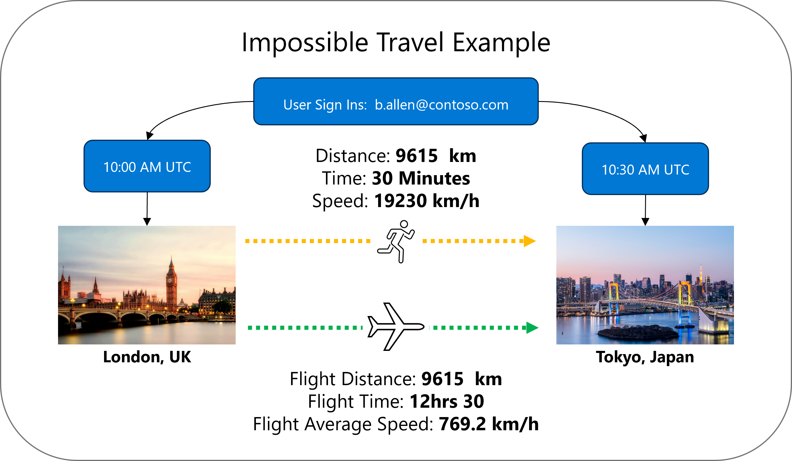

# Impossible Travel Detection - Technical Documentation

## Overview

This KQL (Kusto Query Language) query detects **suspicious and impossible travel** scenarios where a user appears to sign in from two geographically distant locations faster than realistic for the required transport mode. This is a common indicator of compromised credentials.

### What is Suspicious/Impossible Travel?

The query categorizes travel by transport feasibility:

| Required Speed | Classification | Interpretation |
|----------------|----------------|----------------|
| ≤ 100 km/h | **Not flagged** | Car travel possible - not suspicious |
| 101-250 km/h | **Train Required** | High-speed rail needed - mildly suspicious |
| 251-800 km/h | **Plane Required** | Flight needed - moderately suspicious |
| > 800 km/h | **Impossible** | Exceeds commercial aviation - highly suspicious |

**Example:** A user signs in from **London at 10:00 AM** and then from **Tokyo at 10:30 AM**. The distance is approximately 9,500 km, requiring travel at **19,000 km/h** - far exceeding any commercial aircraft's speed (~800 km/h). This is physically impossible and suggests:

- The user's credentials have been compromised
- An attacker is using the stolen credentials from a different location
- Or there's a VPN/proxy that wasn't properly identified





---

## The "Visit" Concept

This detection uses Microsoft's **Visit-based aggregation** approach rather than comparing individual sign-ins.

### Why Visits Instead of Individual Sign-ins?

A user might generate dozens of sign-ins in a short period (multiple apps, token refreshes, etc.). Comparing every sign-in pair would:
- Generate excessive false positives
- Be computationally expensive
- Miss the bigger picture

**A "Visit" aggregates all user activities in a single geographic location within a session.**


---

## S2 Cell Geographic Clustering

Instead of comparing exact coordinates (which vary slightly), we use **S2 Cells** - a hierarchical system that divides Earth into cells of consistent size.


**Reference:** [S2 Geometry Cell Hierarchy](https://s2geometry.io/devguide/s2cell_hierarchy)

---

## Query Flow High Level


1. SigninLogs: Raw events from Microsoft Entra Id
1. Filter & Enrich sign-ins
    1. Successful logins only (ResultType == 0)
    1. Exclude known VPN ranges
    1. Lookup physical office locations (watchlist)
    1. Calculate S2 cell for location
1.  Sessionise Activities
    1. Group consecutive activities at same location
    1. If gap > 4 hours, start new session
    1. Handles A→B→A travel patterns
1. Aggregate into Visits
    1. One row per user per location per session
    1. Calculate visit start/end times
    1. Collect IP addresses, apps, MFA status
1. Compare Visits (Self-Join)
    1. Find pairs of visits for same user
    1. Different locations, chronologically ordered
    1. Calculate time between visits
1. Calculate Distance & Speed
    1. Distance between S2 cell centers
    1. Required travel speed 
    1. Filter: Speed > Car Speed
1. Calculate Probability and Risk Factor
    1. Probability by mode of transport
    1. Sign in factors that influence risk
1. Results

---

## Step-by-Step Explanation

### Parameters

```kusto
// Transport speed thresholds (km/h)
let CarSpeedKmH = 100;              // Average car speed including stops
let TrainSpeedKmH = 250;            // High-speed rail average
let PlaneSpeedKmH = 800;            // Commercial aviation average (max possible)

// Detection parameters
let LookbackPeriod = 1d;            // How far back to analyze
let MinTimeBetweenVisitsMinutes = 15; // Minimum gap to consider
let MinDistanceKm = 100;            // Ignore nearby cell transitions
let MaxSessionGap = 4h;             // Gap that creates new session
let S2CellLevel = 8;                // Geographic precision (~10-25km)
```

| Parameter | Default | Purpose |
|-----------|---------|---------|
| `CarSpeedKmH` | 100 | Average car travel speed. Trips requiring faster speeds are flagged. |
| `TrainSpeedKmH` | 250 | High-speed rail threshold. |
| `PlaneSpeedKmH` | 800 | Maximum realistic speed (commercial aviation). Faster = impossible. |
| `LookbackPeriod` | 1d | Number of days of sign-in data to analyze |
| `MinTimeBetweenVisitsMinutes` | 15 | Ignore visits too close together (likely same session) |
| `MinDistanceKm` | 100 | Ignore alerts for nearby locations (cell boundary crossings) |
| `MaxSessionGap` | 4h | If no activity for 4 hours, the next activity starts a new visit |
| `S2CellLevel` | 8 | Geographic clustering precision (~10-25km metro area) |

---

### Physical Location Watchlist (IP Override)

```kusto
let PhysicalLocationWatchlist = datatable(LocationName:string, city:string, country:string, subnet:string, latitude:real, longitude:real)[
    "Redmond Campus", "Seattle", "United States", "10.0.0.0/8", 47.6370891183, -122.123736172,
    "Thames Valley Park", "Reading", "United Kingdom", "192.168.0.0/16", 51.461308, -0.926993
];
```

**Purpose:** Override geolocation for known office IP ranges.

Azure AD geolocates users based on their public IP address, but this can be inaccurate for:
- Corporate networks using NAT
- VPN exit points
- Cloud egress points

By defining known subnets with their actual physical locations, the query uses the **correct** coordinates instead of potentially incorrect IP geolocation.

```
┌─────────────────────────────────────────────────────────────────────────┐
│                    IP GEOLOCATION OVERRIDE                              │
├─────────────────────────────────────────────────────────────────────────┤
│                                                                         │
│   Without Watchlist:                  With Watchlist:                   │
│   ┌─────────────────────┐             ┌─────────────────────┐           │
│   │ IP: 10.45.67.89     │             │ IP: 10.45.67.89     │           │
│   │ Azure AD says:      │             │ Watchlist says:     │           │
│   │ "Amsterdam, NL"     │   ──────►   │ "Redmond Campus"    │           │
│   │ (ISP datacenter)    │             │ Seattle, USA        │           │
│   └─────────────────────┘             └─────────────────────┘           │
│                                                                         │
│   ❌ Incorrect location              ✅ Correct physical location      │  
│                                                                         │
└─────────────────────────────────────────────────────────────────────────┘
```

---

### Step 1: Filter and Enrich Sign-ins

```kusto
let SignIns = 
    SigninLogs
    | where TimeGenerated > ago(LookbackPeriod)
    | where ResultType == 0  // Successful logins only
    | where not(ipv4_is_in_any_range(IPAddress, KnownVPNRanges))
    | evaluate ipv4_lookup(PhysicalLocationWatchlist, IPAddress, subnet, return_unmatched = true)
    | where (isnotempty(LocationDetails.geoCoordinates.latitude) ...) or (isnotempty(latitude) ...)
    | extend 
        Latitude = coalesce(latitude, toreal(LocationDetails.geoCoordinates.latitude)),
        Longitude = coalesce(longitude, toreal(LocationDetails.geoCoordinates.longitude)),
        City = coalesce(city, tostring(LocationDetails.city)),
        Country = coalesce(country, tostring(LocationDetails.countryOrRegion))
    | extend LocationCell = geo_point_to_s2cell(Longitude, Latitude, S2CellLevel)
```

**Line-by-line breakdown:**

| Line | What it does |
|------|--------------|
| `where ResultType == 0` | Keep only **successful** sign-ins (failed attempts aren't useful for travel detection) |
| `where not(ipv4_is_in_any_range(...))` | Exclude known VPN/proxy IPs that would give false locations |
| `evaluate ipv4_lookup(...)` | **Fast IP-to-subnet matching** - checks if IP is in the watchlist |
| `return_unmatched = true` | Keep all rows, even if not in watchlist (adds null for unmatched) |
| `coalesce(...)` | Use watchlist location if available, otherwise use Azure AD geolocation |
| `geo_point_to_s2cell(...)` | Convert lat/long to S2 cell ID for geographic clustering |

**The `coalesce()` function** returns the first non-null value:
```
coalesce(watchlist_value, azure_ad_value)
         └── Use this if available
                              └── Otherwise use this
```

---

### Step 2: Sessionize Activities

```kusto
let SessionizedSignIns = SignIns
    | sort by UserPrincipalName, LocationCell, TimeGenerated asc
    | extend SessionId = row_window_session(TimeGenerated, 1d, MaxSessionGap, 
        UserPrincipalName != prev(UserPrincipalName) or LocationCell != prev(LocationCell));
```

**Purpose:** Handle the **A→B→A scenario** (user travels somewhere and returns).

Without sessionization, a user going London→Paris→London would have visits merged:
- ❌ One long "London" visit spanning the entire trip

With sessionization (4-hour gap detection):
- ✅ Visit 1: London (morning)
- ✅ Visit 2: Paris (afternoon)  
- ✅ Visit 3: London (evening) - **new session because of the gap**

```
┌────────────────────────────────────────────────────────────────────────────┐
│                    SESSION WINDOWING (A→B→A)                               │
├────────────────────────────────────────────────────────────────────────────┤
│                                                                            │
│   Timeline:                                                                │
│                                                                            │
│   London          Paris           London                                   │
│   ┌─────┐                         ┌─────┐                                  │
│   │█████│         ┌─────┐         │█████│                                  │
│   │█████│         │█████│         │█████│                                  │
│   └─────┘         └─────┘         └─────┘                                  │
│   09:00-11:00     14:00-16:00     20:00-22:00                              │
│                                                                            │
│   ───────────────────────────────────────────────────► Time                │
│        ◄── 3h gap ──►       ◄── 4h gap ──►                                 │
│                                                                            │
│   Session 1       Session 2       Session 3                                │
│   (London)        (Paris)         (London - NEW SESSION)                   │
│                                                                            │
│   Without sessions: London activities would merge into one 13-hour visit!  │
│                                                                            │
└────────────────────────────────────────────────────────────────────────────┘
```

**The `row_window_session()` function:**
- Creates a new session ID when:
  - User changes (`UserPrincipalName != prev(UserPrincipalName)`)
  - Location changes (`LocationCell != prev(LocationCell)`)
  - Gap exceeds `MaxSessionGap` (4 hours)

---

### Step 3: Aggregate into Visits

```kusto
let Visits = SessionizedSignIns
    | summarize 
        VisitStart = min(TimeGenerated),
        VisitEnd = max(TimeGenerated),
        ActivityCount = count(),
        Cities = make_set(City, 10),
        IPAddresses = make_set(IPAddress, 20),
        UniqueIPs = dcount(IPAddress),
        UserAgents = make_set(UserAgent, 10),
        Apps = make_set(AppDisplayName, 10),
        MFAUsed = countif(AuthenticationRequirement == "multiFactorAuthentication"),
        InteractiveLogins = countif(IsInteractive == true)
    by UserPrincipalName, LocationCell, SessionId
```

**Purpose:** Collapse multiple sign-ins into a single "Visit" record.

| Aggregation | Purpose |
|-------------|---------|
| `VisitStart = min(TimeGenerated)` | First activity time |
| `VisitEnd = max(TimeGenerated)` | Last activity time |
| `ActivityCount = count()` | How many sign-ins in this visit |
| `make_set(IPAddress, 20)` | Collect up to 20 unique IPs |
| `dcount(IPAddress)` | Count of distinct IPs |
| `make_set(UserAgent, 10)` | Collect user agents (browser/app signatures) |
| `MFAUsed = countif(...)` | Count of MFA-authenticated sign-ins |
| `InteractiveLogins` | Count of interactive (vs. token refresh) logins |

```kusto
    | extend CellCentroid = geo_s2cell_to_central_point(LocationCell)
    | extend 
        CellLatitude = toreal(CellCentroid.coordinates[1]),
        CellLongitude = toreal(CellCentroid.coordinates[0])
```

**S2 Cell Centroid:** Converts the S2 cell ID back to lat/long coordinates (the center point of the cell) for distance calculations.

---

### Step 4: Compare Visits (Self-Join)

```kusto
Visits
| join kind=inner (
    Visits 
    | project 
        UserPrincipalName,
        LocationCell2 = LocationCell,
        VisitStart2 = VisitStart,
        ...
    )
    on UserPrincipalName
| where SessionId != SessionId2 or LocationCell != LocationCell2  // Different visits
| where VisitEnd < VisitStart2                                    // Chronological order
| where LocationCell != LocationCell2                              // Different locations
| where TimeBetweenVisitsMinutes > MinTimeBetweenVisitsMinutes    // Not too close
| where TimeBetweenVisitsMinutes < 1440                           // Within 24 hours
```

**What is a Self-Join?**

A self-join matches a table against itself. Here, we're finding **pairs of visits for the same user**.

```
┌─────────────────────────────────────────────────────────────────────────────┐
│                         SELF-JOIN CONCEPT                                   │
├─────────────────────────────────────────────────────────────────────────────┤
│                                                                             │
│   Visits Table:                   After Self-Join (same user):              │
│   ┌─────────────────────────┐     ┌─────────────────────────────────────┐   │
│   │ User  │ Location │ Time │     │ Visit1        │ Visit2              │   │
│   ├───────┼──────────┼──────┤     ├───────────────┼─────────────────────┤   │
│   │ Alice │ London   │ 09:00│     │ Alice,London  │ Alice,Paris         │   │
│   │ Alice │ Paris    │ 12:00│     │ Alice,London  │ Alice,Tokyo         │   │
│   │ Alice │ Tokyo    │ 15:00│     │ Alice,Paris   │ Alice,Tokyo         │   │
│   │ Bob   │ NYC      │ 10:00│     │ Bob,NYC       │ Bob,LA              │   │
│   │ Bob   │ LA       │ 14:00│     │               │                     │   │
│   └───────┴──────────┴──────┘     └───────────────┴─────────────────────┘   │
│                                                                             │
│   Result: Every possible pair of visits for each user                       │
│                                                                             │
└─────────────────────────────────────────────────────────────────────────────┘
```

**Filters applied:**
- `VisitEnd < VisitStart2` - Visit 1 must end before Visit 2 starts (chronological)
- `LocationCell != LocationCell2` - Must be different locations
- Time between: 15 minutes to 24 hours (too short = same session, too long = not relevant)

---

### Step 5: Calculate Distance and Speed

```kusto
| extend DistanceKm = geo_distance_2points(CellLongitude, CellLatitude, 
                                            CellLongitude2, CellLatitude2) / 1000
| extend RequiredSpeedKmH = DistanceKm / (TimeBetweenVisitsMinutes / 60.0)
// Apply suspicious travel filter - flag anything requiring faster than car travel
| where RequiredSpeedKmH > CarSpeedKmH
| where DistanceKm > MinDistanceKm
```

**`geo_distance_2points()`** calculates the great-circle distance between two coordinates in meters. We divide by 1000 to get kilometers.

**Required Speed Calculation:**
```
                    Distance (km)
Speed (km/h) = ─────────────────────
               Time (minutes) / 60
```

**Filtering Logic:**
- Only trips requiring **faster than car travel (>100 km/h)** are flagged
- This enables categorization by transport mode in the next step

**Example:**
- Distance: London to Paris = 344 km
- Time between visits: 30 minutes = 0.5 hours
- Required Speed: 344 / 0.5 = **688 km/h** → **Plane Required** (flagged)

- Distance: London to Birmingham = 160 km  
- Time between visits: 2 hours
- Required Speed: 160 / 2 = **80 km/h** → **Car Possible** (not flagged)

---

### Step 6: Check Shared Properties

```kusto
| extend 
    SharedIPs = set_intersect(IPAddresses, IPAddresses2),
    SharedUserAgents = set_intersect(UserAgents, UserAgents2),
    SharedApps = set_intersect(Apps, Apps2)
| extend 
    HasSharedIP = array_length(SharedIPs) > 0,
    HasSharedUserAgent = array_length(SharedUserAgents) > 0
| where not(HasSharedIP)  // Suppress if same IP used
```

**Purpose:** Reduce false positives by checking if the two visits share characteristics.

**`set_intersect()`** finds common elements between two arrays:
```
IPAddresses1: ["1.2.3.4", "5.6.7.8"]
IPAddresses2: ["5.6.7.8", "9.10.11.12"]
SharedIPs:    ["5.6.7.8"]  ← Common IP found!
```

**If visits share the same IP**, they're likely from a VPN/proxy that wasn't in our exclusion list. We suppress these alerts.

```
┌────────────────────────────────────────────────────────────────────────────┐
│                    SHARED PROPERTY ANALYSIS                                │
├────────────────────────────────────────────────────────────────────────────┤
│                                                                            │
│   Visit 1 (London)              Visit 2 (Tokyo)                            │
│   ┌─────────────────────┐       ┌─────────────────────┐                    │
│   │ IPs: 1.2.3.4        │       │ IPs: 9.10.11.12     │                    │
│   │ Agent: Chrome/Win   │       │ Agent: Safari/Mac   │                    │
│   │ Apps: Outlook,Teams │       │ Apps: Outlook       │                    │
│   └─────────────────────┘       └─────────────────────┘                    │
│                                                                            │
│   Shared IPs: NONE              → Not VPN (proceed with alert)             │
│   Shared Agents: NONE           → Different device (suspicious)            │
│   Shared Apps: Outlook          → Same apps (slightly less suspicious)     │
│                                                                            │
└────────────────────────────────────────────────────────────────────────────┘
```

---

### Step 7: Determine Travel Feasibility

```kusto
| extend 
    PossibleByCar = RequiredSpeedKmH <= CarSpeedKmH,
    PossibleByTrain = RequiredSpeedKmH <= TrainSpeedKmH,
    PossibleByPlane = RequiredSpeedKmH <= PlaneSpeedKmH,
    IsPhysicallyImpossible = RequiredSpeedKmH > PlaneSpeedKmH
```

**Transport Mode Classification:**

```
┌────────────────────────────────────────────────────────────────────────────┐
│                    TRAVEL FEASIBILITY THRESHOLDS                           │
├────────────────────────────────────────────────────────────────────────────┤
│                                                                            │
│   Required Speed (km/h)                                                    │
│   ─────────────────────────────────────────────────────────────────────►   │
│   0        100       250                   800                    ∞        │
│   │         │         │                     │                     │        │
│   │◄───────►│         │                     │                     │        │
│   │Car      │◄───────►│                     │                     │        │
│   │Possible │Train    │◄───────────────────►│                     │        │
│   │(not     │Required │Plane Required       │◄───────────────────►│        │
│   │flagged) │         │                     │IMPOSSIBLE           │        │
│   │         │         │                     │                     │        │
│   └─────────┴─────────┴─────────────────────┴─────────────────────┘        │
│                                                                            │
│   Base Probability:  10        20                40              70        │
│                                                                            │
└────────────────────────────────────────────────────────────────────────────┘
```

**TravelFeasibility Classification:**

```kusto
TravelFeasibility = case(
    IsPhysicallyImpossible, "Impossible",
    not(PossibleByTrain) and PossibleByPlane, "Plane Required",
    not(PossibleByCar) and PossibleByTrain, "Train Required", 
    PossibleByCar, "Car Possible",
    "Unknown"
)
```

| Required Speed | TravelFeasibility | Base Probability |
|----------------|-------------------|------------------|
| ≤ 100 km/h | Car Possible | 10 (filtered out by Step 5) |
| 101-250 km/h | Train Required | 20 |
| 251-800 km/h | Plane Required | 40 |
| > 800 km/h | Impossible | 70 |

---

### Step 8: Calculate Compromise Probability

The query calculates a **Compromise Probability Score (0-100)** based on three factors:

```kusto
CompromiseProbability = min_of(BaseProbability + AuthRiskScore + BehaviorRiskScore, 100)
```

#### Base Probability (from travel feasibility)

| Travel Feasibility | Base Score | Rationale |
|--------------------|------------|-----------|
| Impossible | 70 | Very suspicious but not definitive alone |
| Plane Required | 40 | Still possible but uncommon |
| Train Required | 20 | Moderately suspicious |
| Car Possible | 10 | Low suspicion (filtered out) |

#### Authentication Risk Score

| Risk Factor | Score | Detection Logic |
|-------------|-------|-----------------|
| MFA Degradation | +20 | MFA in Visit 1, no MFA in Visit 2 |
| No MFA Either Visit | +10 | Neither visit used MFA |
| MFA Only in Visit 2 | +5 | Attacker may have set up MFA |
| Interactive→Non-Interactive | +15 | Possible token theft |
| Both Non-Interactive | +5 | Token-based access (could be legitimate) |

**MFA Degradation** is particularly suspicious: if the legitimate user had MFA enabled, but the second visit didn't require it, an attacker may have bypassed MFA through token theft or session hijacking.

#### Behavioral Risk Score

| Risk Factor | Score | Detection Logic |
|-------------|-------|-----------------|
| Different User Agents | +10 | Different device/browser signature |
| Different Apps | +5 | Different applications accessed |
| Different Countries | +10 | International travel |
| Under 1 Hour Gap | +10 | Very close in time |

#### Probability Levels

```kusto
ProbabilityLevel = case(
    CompromiseProbability >= 80, "Very High",
    CompromiseProbability >= 60, "High", 
    CompromiseProbability >= 40, "Medium",
    CompromiseProbability >= 20, "Low",
    "Very Low"
)
```

**Example Calculations:**

| Scenario | Base | Auth | Behavior | Total | Level |
|----------|------|------|----------|-------|-------|
| Impossible travel, MFA degradation, different device, different country | 70 | 20 | 30 | 100 | Very High |
| Plane required, no MFA both visits, different device | 40 | 10 | 10 | 60 | High |
| Train required, MFA both visits, same device | 20 | 0 | 0 | 20 | Low |

#### Risk Factors String

The query builds a human-readable list of all detected risk factors:

```kusto
RiskFactors = strcat_array(
    array_concat(
        iff(IsPhysicallyImpossible, dynamic(["Travel physically impossible"]), dynamic([])),
        iff(MFA_Degradation, dynamic(["MFA in Visit 1, no MFA in Visit 2 (degradation)"]), dynamic([])),
        iff(DifferentUserAgents, dynamic(["Different user agents/devices"]), dynamic([])),
        // ... more factors
    ),
    ", "
)
```

**Example output:** `"Travel physically impossible, MFA in Visit 1, no MFA in Visit 2 (degradation), Different user agents/devices, Different countries"`

---

### Step 9: Output Results

The final projection provides all context needed for investigation:

| Column Group | Fields | Purpose |
|--------------|--------|---------|
| **Probability** | CompromiseProbability, ProbabilityLevel | Prioritization (0-100 score) |
| **Travel** | TravelFeasibility | Car/Train/Plane/Impossible |
| **User** | UserPrincipalName | Who |
| **Visit 1** | Location, Cell, Start/End, Activities, IPs, MFA, Interactive | First location details |
| **Visit 2** | Location, Cell, Start, Activities, IPs, MFA, Interactive | Second location details |
| **Travel Analysis** | TimeBetweenVisits, Distance, RequiredSpeed, IsSameCountry | Travel metrics |
| **Risk Breakdown** | AuthRiskScore, BehaviorRiskScore | Score components |
| **Similarity** | SharedUserAgents, SharedApps | Common elements |
| **Risk Factors** | RiskFactors | Human-readable risk summary |

Results are ordered by `CompromiseProbability desc, TimeBetweenVisitsMinutes asc` to surface the most urgent alerts first.

---

## Sample Output

```
| Probability | Level | User | Visit 1 | Visit 2 | Travel | Risk Factors |
|-------------|-------|------|---------|---------|--------|--------------|
| 100 | Very High | alice@contoso.com | London, UK (10:00 - 10:30) | Sydney, Australia (10:35) | Impossible (48,000 km/h) | Travel physically impossible, MFA degradation, Different devices, Different countries |
| 65 | High | bob@contoso.com | Paris, France (09:00 - 09:45) | Berlin, Germany (10:00) | Plane Required (580 km/h) | Flight required, No MFA on either visit, Different user agents |
| 30 | Low | charlie@contoso.com | London, UK (14:00 - 14:30) | Manchester, UK (15:30) | Train Required (200 km/h) | Train/flight required, Same country different regions |
```

---

## Tuning Recommendations

### Reduce False Positives

1. **Add more VPN ranges to `KnownVPNRanges`**
   - Corporate VPNs
   - Cloud service IPs (Azure, AWS, GCP)
   - Known proxy services

2. **Expand `PhysicalLocationWatchlist`**
   - All office locations
   - Known partner/vendor networks

3. **Adjust `MinDistanceKm`**
   - Increase to ignore more nearby transitions
   - Decrease for tighter detection

4. **Tune `S2CellLevel`**
   - Increase level (9, 10) for smaller cells in dense areas
   - Decrease level (7, 6) for broader aggregation

5. **Adjust speed thresholds**
   - Increase `CarSpeedKmH` to reduce "Train Required" alerts in areas with motorways
   - Adjust `TrainSpeedKmH` based on regional rail infrastructure

### Increase Sensitivity

1. **Lower `CarSpeedKmH`** to catch more cases
2. **Increase `LookbackPeriod`** to catch slower attacks
3. **Remove the shared user agent filter** if attackers might clone signatures

### Focus on High-Risk Alerts

1. **Filter by probability level** - Start by investigating "Very High" and "High" alerts
2. **Prioritize MFA degradation** - Filter where `AuthRiskScore >= 20`
3. **International travel only** - Filter where `IsSameCountry == false`

---

## References

- [Microsoft: Detecting and Remediating Impossible Travel](https://techcommunity.microsoft.com/blog/microsoftthreatprotectionblog/detecting-and-remediating-impossible-travel/3366017)
- [S2 Geometry Cell Hierarchy](https://s2geometry.io/devguide/s2cell_hierarchy)
- [KQL geo_distance_2points()](https://learn.microsoft.com/en-us/azure/data-explorer/kusto/query/geo-distance-2points-function)
- [KQL row_window_session()](https://learn.microsoft.com/en-us/azure/data-explorer/kusto/query/row-window-session-function)
- [KQL ipv4_lookup plugin](https://learn.microsoft.com/en-us/azure/data-explorer/kusto/query/ipv4-lookup-plugin)
