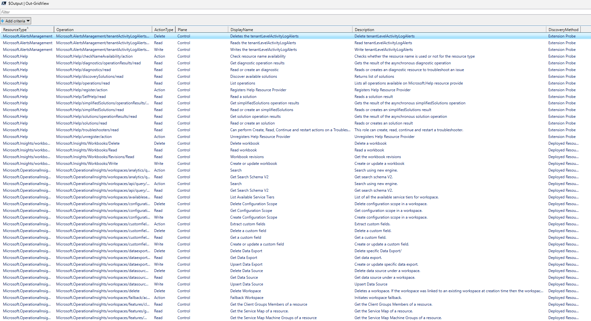

# Get-ResourceTypeActions

Discovers Azure resource types within a given scope — including extension providers — and retrieves all their control plane and data plane operations.

## Overview

When working with Azure RBAC, it can be difficult to get a complete picture of every operation available for the resource types in your environment. `Get-ResourceTypeActions.ps1` solves this by combining multiple discovery methods into a single script:

1. **Deployed Resource Discovery** — Uses `Get-AzResource` to find all resource types currently deployed in the target scope (subscription or resource group).
2. **Extension Provider Discovery** — Queries the ARM REST API to identify registered providers with the `SupportsExtension` capability (e.g., Microsoft.SecurityInsights, Microsoft.Advisor).
3. **Extension Probing** — For each deployed resource, probes discovered extension providers to determine which extensions are actually attached. For example, it can detect that Microsoft.SecurityInsights is active on a Log Analytics workspace.
4. **Operation Enumeration** — Queries `Get-AzProviderOperation` for every discovered resource type and extension provider, returning all available operations with metadata.

### Why Extension Provider Discovery Is Needed

Standard Azure resource types like `Microsoft.Storage/storageAccounts` or `Microsoft.Compute/virtualMachines` are straightforward to discover — they are top-level resources that appear directly in a resource group and are returned by `Get-AzResource`.

**Extension resource providers** work differently. An extension resource type (such as `Microsoft.SecurityInsights`) does not deploy its own top-level resources into a resource group. Instead, its resources exist _as children of another resource_. For example, Microsoft Sentinel (SecurityInsights) resources live under a Log Analytics workspace:

```
/subscriptions/{sub}/resourceGroups/{rg}/providers/Microsoft.OperationalInsights/workspaces/{workspace}/providers/Microsoft.SecurityInsights/alertRules/{rule}
```

This creates two discovery challenges:

1. **Not natively discoverable in a resource group** — Running `Get-AzResource` against a resource group will return the Log Analytics workspace, but it will _not_ return the Microsoft.SecurityInsights resources attached to it. The extension resources are invisible to standard resource enumeration.
2. **No direct discoverable relationship** — There is no Azure API that tells you "this workspace has SecurityInsights attached to it." The relationship between a parent resource and its extension providers is implicit, not declared anywhere in the resource metadata. One could argue that the existence of the Microsoft.OperationalInsights/Solution provides the details of the relationship for this resource type, but working it out for every possible resource type will take more effort than this script."

To bridge this gap, the script takes a two-phase approach:

- **Phase 1 (Discovery):** It queries the ARM `/providers` API to find all resource providers in the subscription that have the `SupportsExtension` capability. This tells us _which providers could potentially_ be attached to resources, but not _which resources they are attached to_.
- **Phase 2 (Probing):** For each discovered extension provider, the script makes targeted REST API calls against each deployed resource to check whether that extension actually has resources present. If the probe returns data, the extension is confirmed as active and its operations are included in the results.

This probing approach is the only reliable way to build a complete picture of all resource types — and therefore all RBAC operations — that are relevant to a given scope.

```
┌─────────────────────────────────┐
│  Step 1: Get-AzResource         │
│  Discover deployed resources    │
└──────────────┬──────────────────┘
               │
               ▼
┌─────────────────────────────────┐
│  Step 2: REST API /providers    │
│  Find extension providers       │
│  (SupportsExtension capability) │
└──────────────┬──────────────────┘
               │
               ▼
┌─────────────────────────────────┐
│  Step 3: Probe extensions       │
│  Test each extension against    │
│  deployed resources             │
└──────────────┬──────────────────┘
               │
               ▼
┌─────────────────────────────────┐
│  Step 4: Get-AzProviderOperation│
│  Enumerate all operations       │
└─────────────────────────────────┘
```

## Prerequisites

- **PowerShell 5.1+** or **PowerShell 7+**
- **Az.Resources** module (`Install-Module -Name Az -Scope CurrentUser`)
- An authenticated Azure session (`Connect-AzAccount`)

## Parameters

| Parameter | Type | Required | Description |
|---|---|---|---|
| `-ResourceType` | `string[]` | Yes (ByType) | One or more Azure resource types to query directly. Skips all discovery logic. |
| `-SubscriptionId` | `string` | No (ByScope) | Target subscription for resource discovery. Uses current context if omitted. |
| `-ResourceGroupName` | `string` | No (ByScope) | Target resource group for resource discovery, including extension providers. |
| `-SkipExtensionProbe` | `switch` | No (ByScope) | Skip extension provider probing for faster results. |

The script uses two parameter sets:

- **ByType** — Directly query operations for one or more known resource types.
- **ByScope** — Discover resource types from a subscription or resource group, optionally including extension providers.

## Usage Examples

### Query a specific resource type directly

```powershell
.\Get-ResourceTypeActions.ps1 -ResourceType "Microsoft.Storage/storageAccounts"
```

### Query multiple resource types

```powershell
.\Get-ResourceTypeActions.ps1 -ResourceType "Microsoft.Storage/storageAccounts", "Microsoft.SecurityInsights"
```

### Discover all resource types in a resource group (with extension probing)

```powershell
.\Get-ResourceTypeActions.ps1 -SubscriptionId "00000000-0000-0000-0000-000000000000" -ResourceGroupName "myRG"
```

### Discover resource types in a resource group using the current subscription

```powershell
.\Get-ResourceTypeActions.ps1 -ResourceGroupName "myRG"
```

### Skip extension probing for faster results

```powershell
.\Get-ResourceTypeActions.ps1 -ResourceGroupName "myRG" -SkipExtensionProbe
```

### Pipe results to Out-GridView or CSV

```powershell
# Interactive grid view
.\Get-ResourceTypeActions.ps1 -ResourceGroupName "myRG" | Out-GridView

# Export to CSV
.\Get-ResourceTypeActions.ps1 -ResourceGroupName "myRG" | Export-Csv .\actions.csv -NoTypeInformation
```

## Output

The script returns an array of objects with the following properties:

| Property | Description |
|---|---|
| `ResourceType` | The Azure resource type or extension provider namespace. |
| `Operation` | The full operation string (e.g., `Microsoft.Storage/storageAccounts/read`). |
| `ActionType` | The type of action: `Read`, `Write`, `Delete`, or `Action`. |
| `Plane` | Whether the operation is `Control` plane or `Data` plane. |
| `DisplayName` | Human-readable name of the operation. |
| `Description` | Description of what the operation does. |
| `DiscoveryMethod` | How the resource type was found: `Manual`, `Deployed Resource`, or `Extension Probe`. |

### Console Output

During execution, the script provides progress information including:

- Deployed resource types found
- Registered extension providers discovered
- Extension probe results (which extensions are attached to which resources)
- Per-type operation counts (control plane vs. data plane)
- A final summary of total resource types, operations, and breakdown by plane

### Grid View Output

When piped to `Out-GridView`, the results are displayed in an interactive, filterable table:



### Summary Example

```
============================================
  Summary
============================================
  Resource Types:        12
  Total Operations:      347
  Control Plane Actions: 298
  Data Plane Actions:    49
  Extension Operations:  112
============================================
```

## Notes

- Extension probing involves making REST API calls against each deployed resource for each extension provider. In environments with many resources and extension providers, this can take some time. Use `-SkipExtensionProbe` if you only need operations for deployed resource types.
- The script filters extension providers to only those registered in the subscription, reducing unnecessary probing.
- Results are sorted by `ResourceType`, `Plane`, `ActionType`, and `Operation` for easy review.
